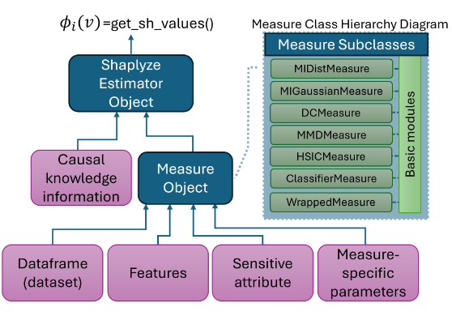
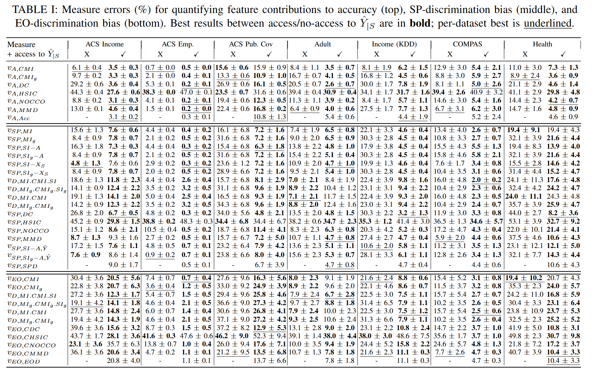
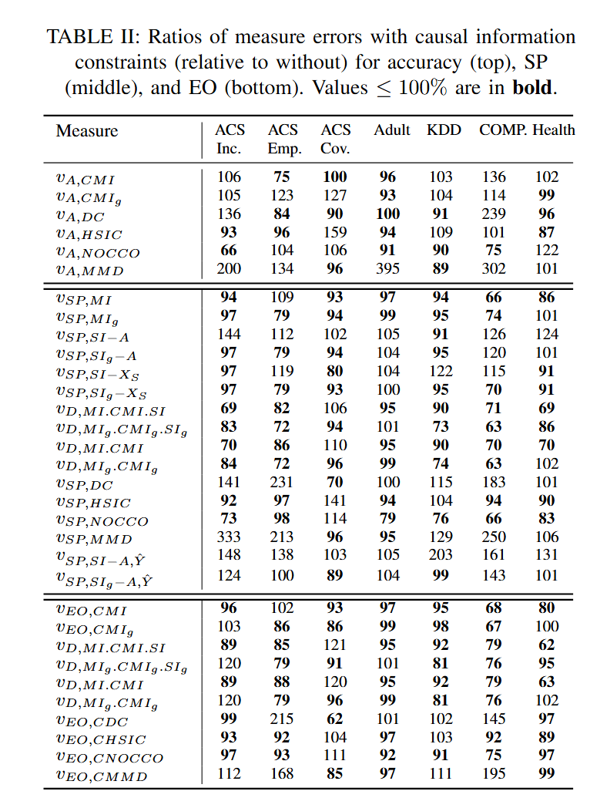

# Shaplyze: A Toolkit for Shapley-based Feature Importance and Fairness Evaluation
[](https://www.python.org/downloads/release/python-3110/)

Note: This project is licensed under the Apache 2.0 License

**Shaplyze** is an open-source toolkit for Shapley-value–based feature attribution, supporting both **model explainability** and **algorithmic fairness**. 
It provides a modular, model-agnostic framework with utility functions from information theory, kernel methods, and fairness metrics, including support for causal (asymmetric) Shapley values.


## 📦 Installation (Python 3.11+ Recommended)

We recommend using a virtual environment with [Conda](https://docs.conda.io) or `venv`.

### ✅ 1. Create and activate environment
```bash
conda create -n shaplyze python=3.11
conda activate shaplyze
```

### ✅ 2. Install required packages
```bash
pip install "numpy<2.0" pandas scikit-learn
pip install folktables liac-arff
pip install cvxpy ecos mosek
pip install category_encoders
pip install matplotlib seaborn
pip install pycddlib-standalone
pip install dit
```

---

> 🔧 **Note on `pycddlib`**: If installation fails due to missing `setoper.h` or `gmp.h`, you can use the pure Python fallback:
> ```bash
> pip install pycddlib-standalone
> ```

> ⚠️ **Note on `dit`**: The `dit` library depends on `pycddlib` and `pypoman`. If you're using `pycddlib-standalone`, it should work transparently. In rare cases, you may need to install `dit` from source:
> ```bash
> git clone https://github.com/dit/dit.git
> cd dit
> pip install . --no-deps
> ```

> 📝 **Note on `mosek`**: To use the MOSEK solver, you need a valid license. You can obtain a free academic license from [https://www.mosek.com](https://www.mosek.com).
---
## 🔍 Examples Usage:

This example demonstrates how to use the `SurrogateMeasure` class to evaluate the mutual information between features and the sensitive attribute using predicted outputs from a classifier.

### Step 1: Prepare a Simple Dataset
```python
import pandas as pd
import numpy as np

# Generate some mock data
np.random.seed(0)
Xc = np.random.randn(100)
Xg = np.random.randn(100)
A = np.random.rand(100)
Y = (Xc + Xg + A + 0.1*np.random.randn(100) > 0).astype(int)

# Construct DataFrame
df = pd.DataFrame({
    'X1': Xc,
    'X2': Xg,
    'A': A,
    'Y': Y
})

# Quantize continuous variables into 2 equal-width bins
for col in ['X1', 'X2', 'A', 'Y']:
    df[col] = pd.cut(df[col], bins=2, labels=False)

# Define inputs for the measure
features = ['X1', 'X2']
sensitive_attribute = ['A']
output = ['Y']
bins = (2, 2, 2, 2)
```

### Step 2: Non-classifier Based Measures
```python
from src.measures import (
    I_Xs_A, I_Y_Xs_given_AXsc, SI_A_Xs_Y, SI_Xs_A_Y,
    I_Xs_A_given_Y, I_A_Xs_times_IAXs_given_Y_times_SI_Y_Xs_A,
    HSIC_Xs_Y, NOCCO_Xs_Y, MMD_Xs_Y, MMD_Xs_A
)
from src.shaplyze import ShaplyzeEstimator

# Example with mutual information I(Xs;A)
measure = I_Xs_A(df, features, sensitive_attribute, output, bins)
estimator = ShaplyzeEstimator(measure)
shap_values = estimator.get_sh_values()
print("Shapley values (I_Xs_A):", shap_values)
```

### Step 3: Classifier-based Measures
```python
from sklearn.neural_network import MLPClassifier
from src.classifier import AccuracyMeasure, DPMeasure, EOMeasure

clf = MLPClassifier(hidden_layer_sizes=(20,), max_iter=500, random_state=0)

# Accuracy Measure example
measure_acc = AccuracyMeasure(
    df, features, sensitive_attribute, output,
    classifier=clf, mode="replace", categorical_features=None
)
estimator_acc = ShaplyzeEstimator(measure_acc)
shap_values_acc = estimator_acc.get_sh_values()
print("Shapley values (Accuracy):", shap_values_acc)
```

### Step 4: Surrogate Measure Example
```python
from src.measures import SurrogateMeasure

# Create SurrogateMeasure using drop-out mode
surrogate_mi = SurrogateMeasure(
    df, features, sensitive_attribute, output,
    measure_class=I_Xs_A,
    mode="replace",
    X=features, A=sensitive_attribute, Y=output,
    bins=bins
)

# Evaluate using ShaplyzeEstimator
estimator = ShaplyzeEstimator(surrogate_mi)
shap_values = estimator.get_sh_values()
print("Shapley values from surrogate measure:", shap_values)
```


## 📁 Datasets (for benchmarking)

To run the examples in the toolkit, you must manually download the following datasets and place them inside the `datasets/` folder at the root of the project.

### 🔸 1. COMPAS Dataset
- **Required file**: `datasets/compas-scores-two-years.csv`
- **Source**: [ProPublica GitHub Repository](https://github.com/propublica/compas-analysis)
- **Direct download**: [compas-scores-two-years.csv](https://raw.githubusercontent.com/propublica/compas-analysis/master/compas-scores-two-years.csv)

---

### 🔸 2. Adult Dataset
- **Required file**: `datasets/adult.csv`
- **Source**: UCI Machine Learning Repository  
- **URL**: [https://archive.ics.uci.edu/ml/datasets/adult](https://archive.ics.uci.edu/ml/datasets/adult)

---

### 🔸 3. Census Income KDD Dataset (ARFF)
- **Required file**: `datasets/dataset.arff`
- **Source**: UCI KDD Census Income Dataset  
- **URL**: [https://kdd.ics.uci.edu/databases/census-income/census-income.data](https://kdd.ics.uci.edu/databases/census-income/)

---

### 🔸 4. Heritage Health Dataset
- **Required files**:
  - `datasets/Claims.txt`
  - `datasets/Members.txt`
- **Source**: [Heritage Health Prize on Kaggle](https://www.kaggle.com/c/hhp)
- **Note**: You must be logged into Kaggle to download these files.

---

📌 Ensure all files are placed inside the `datasets/` directory using the exact filenames listed above.

## 📁 Run Benchmarking

This benchmark separates the **computation of measure values** from the **computation of Shapley values**:

1. The `benchmarking.py` script first computes measure values (191 measure for different seed numbers) for subsets of features and saves them as dictionaries.  
2. The script `generate_results.py` then computes Shapley values **with and without causal information** using the precomputed dictionaries.  


To benchmark was conducted on cluster where you can run specific measure for specific seed on specific dataset using `<id>` in parallel on the cluster using the following command:
```bash
python benchmarking.py --dataset <id>
```
To run the benchmark sequentially, use:
```bash
python benchmarking.py --dataset -1
```
After running the benchmark, you can process the results to compute Shapley values using:
```bash
python generate_results.py
```

## 📊 Comprehensive Overview of Benchmark Datasets

We briefly describe each of the 7 datasets as follows:

**ACS Income dataset**  
Contains annual income information for over **1.66 million individuals**. Target label $Y$ indicates whether an individual earns more than \$50k. Race is the sensitive attribute: Black/African-American (10%) vs. White (90%). The positive rate (> \$50k) is **39% for White** and **24.6% for Black** individuals. Selected features: *Class of worker, Sex, Usual weekly work hours, Educational attainment*.  

**ACS Employment dataset**  
Contains employment status for over **3.24 million individuals**. $Y$ is the employment status (positive rate: 57%). Sensitive attribute: disability status (Disabled 16% — positive rate 21%; Non-disabled 84% — positive rate 64%). Selected features: *Race, Marital status, Age, Mobility status, Parents’ employment status*.  

**ACS Public Coverage dataset**  
Contains information about public-health insurance coverage for over **1.13 million low-income individuals** not eligible for Medicare. $Y$ indicates public health coverage (positive rate: 30%). Sensitive attribute: Race (White 72% — positive rate 27%; Non-white 28% — positive rate 36%). Selected features: *Age, Parents’ employment status, Sex, Mobility status, Childbirth within past 12 months*.  

**Adult dataset**  
Extracted from the 1994 Census database; **48,842 individuals**. $Y$ indicates income > \$50k (positive rate: 25%). Sensitive attribute: Gender (Females 32% — positive rate 11%; Males 68% — positive rate 31%). Selected features: *Age, Educational-num, Capital-gain, Capital-loss, Hours-per-week, Relationship*.  

**Census Income (KDD) dataset**  
Derived from the 1994–1995 U.S. Census Bureau surveys; **399,285 records**. $Y$: annual income > \$50k (positive rate: 6%). Sensitive attribute: Sex (Males 52% — positive rate 10%; Females 48% — positive rate 2.5%). Selected features: *Education, Marital status, Race, Capital gains, Capital loss, Number of employees*.  

**ProPublica COMPAS dataset**  
Contains criminal history and demographics for **5,334 defendants** in Broward County, Florida (2013–14). $Y$: arrest within 2 years of release (positive rate: 47%). Sensitive attribute: Race (Caucasian 39% — positive rate 39%; Black 61% — positive rate 52%). Selected features: *Age category, Charge degree, Sex, Priors count, Length of stay*.  

**Heritage Health dataset**  
Insurance claims and physician records for **60,000 patients**. $Y$: Charlson Comorbidity Index = 0 (positive rate: 35%). Sensitive attribute: Age (Older than 70: 10% — positive rate 57%; Younger than 70: 90% — positive rate 53%). Selected features: *Sex, Claim year, Service location, Payment delay duration, Days since first service*.  

# Results




## 🔧 Toolkit Extension Example

To demonstrate the modularity of our design, we show how to implement a new measure based on the **multiple linear correlation coefficient** between a feature subset $X_S$ and the target $Y$.  

The multiple correlation coefficient is estimated empirically as:

$$
R(X_S;Y) = \sqrt{1 - \frac{\sum_{i=1}^n (y_i - \hat{y}_i)^2}{\sum_{i=1}^n (y_i - \bar{y})^2}} ,
$$

where $\hat{y}$ denotes the fitted values obtained from the linear regression of $Y$ on $X_S$, and $\bar{y}$ is the empirical mean of $Y$.  

The extension requires creating a **basic module** and then building a **measure class** on top of it.

### Module: `LinearCorrelation`
```python
class LinearCorrelation:
    @staticmethod
    def LC(df, X, Y):
        # Multiple correlation coefficient (R) of X with Y
        X_, y = np.c_[np.ones(len(df)), df[X]], df[Y[0]]
        r2 = 1 - np.sum((y - X_ @ np.linalg.lstsq(X_, y, rcond=None)[0])**2) / np.sum((y - y.mean())**2)
        return np.sqrt(max(r2, 0))
```

### Measure Class: `LCorr_XY`
```python
class LCorr_XY(Measure):
    def evaluate(self, Xs):
        return 0.0 if len(Xs) == 0 else LinearCorrelation.LC(self.dataframe, Xs, self.Y)

    def name(self):
        return "LCorr(X;Y)"
```

# Computational complexity

The computation of Shapley values involves evaluating a utility function $v(S)$ for all subsets $S \subseteq [m]$, where $m$ is the number of features. This requires **exponential complexity**:

$$
O\big(2^m \cdot f(m,n)\big),
$$

where $n$ is the number of data samples and $f(m,n)$ is the cost of evaluating the chosen utility function on a given subset.  

Since different measures are built on different **basic modules** (e.g., `MIDist`, `MMD`, `HSIC`, `Classifier`), the function $f(m,n)$ varies depending on the underlying statistical or model-based computation. We list the complexity for each module.
### 🔹 MIDist Complexity

The `MIDist` module relies on empirical **discrete joint distributions**.

- **Mutual Information (MI):**  
  $O(|Z|\cdot|A|)$ — linear in the support sizes of $Z$ and $A$.

- **Unique Information (UI) via BROJA PID:**  
  $O(|Z|\cdot|A|\cdot|B|)$ — as shown in *Makkeh et al. (2018)*, due to solving a constrained convex optimization.

### 🔹 MIGaussian Complexity

The `MIGaussian` module computes information-theoretic quantities under a **multivariate Gaussian assumption** using covariance matrices.

- **MI / CMI / Entropy:**  
  Require covariance estimation and log-determinants. Complexity:  
  $$
  O(n \cdot d^2)
  $$  
  where $n$ is the number of samples and $d = |Z| + |A| + |B|$ is the joint feature dimension.

- **UI / Red / Syn (MMI PID):**  
  Computed via simple combinations of MI values (no optimization as in BROJA). Complexity:  
  $$
  O(n \cdot d^2)
  $$
### 🔹 DC Complexity

The `DC` module computes distance covariance (dCov) by iterating over all joint outcomes of $Z$ and $A$, comparing $p(z,a)$ with $p(z)p(a)$.  

Complexity:  
$$
O(|Z|\cdot|A|)
$$
### 🔹 HSIC & NOCCO Complexity

Both `HSIC` and `NOCCO` rely on **kernel matrices** (Gaussian RBF), which require pairwise computations over $n$ samples.

- **HSIC:**  
  Builds centered kernel matrices and computes trace products.  
  Complexity:  
  $$
  O(n^2)
  $$

- **NOCCO:**  
  Similar to HSIC but with additional normalization and matrix inversion.  
  Complexity:  
  $$
  O(n^2)
  $$
### 🔹 MMD Complexity

The `MMD` module computes the maximum mean discrepancy (MMD) using **RBF kernel matrices** between two sample sets.

- **MMD:**  
  Requires pairwise kernel evaluations between $m$ and $n$ samples.  
  Complexity:  
  $$
  O(m^2 + n^2 + mn)
  $$
